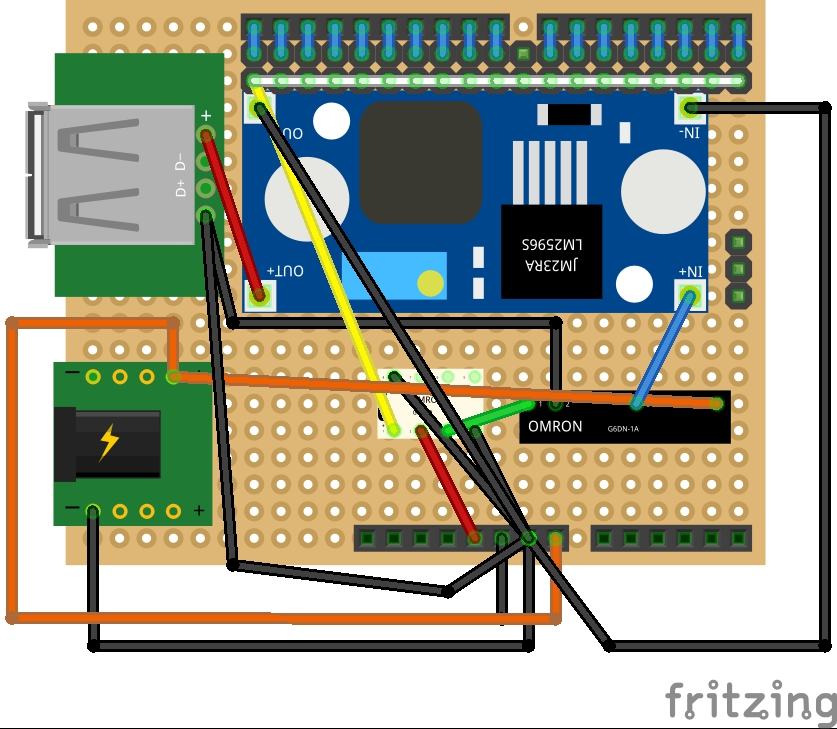
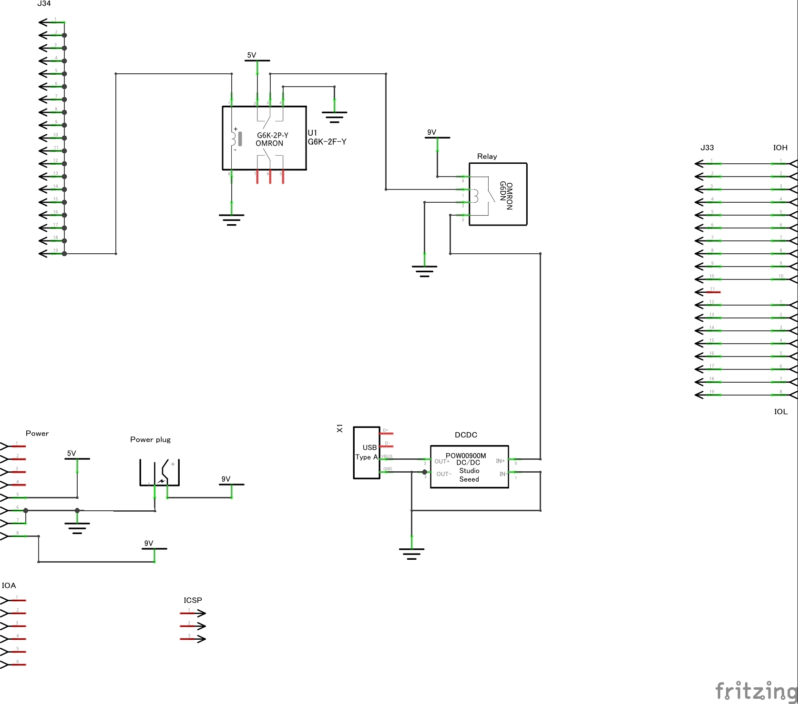
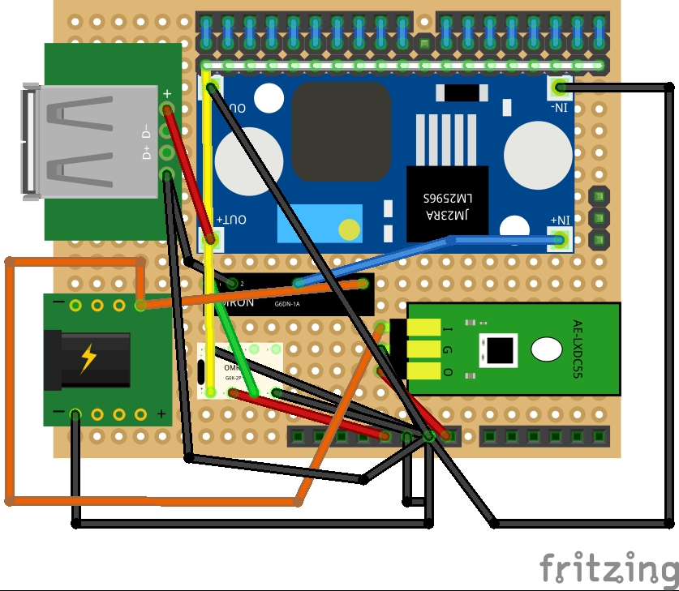
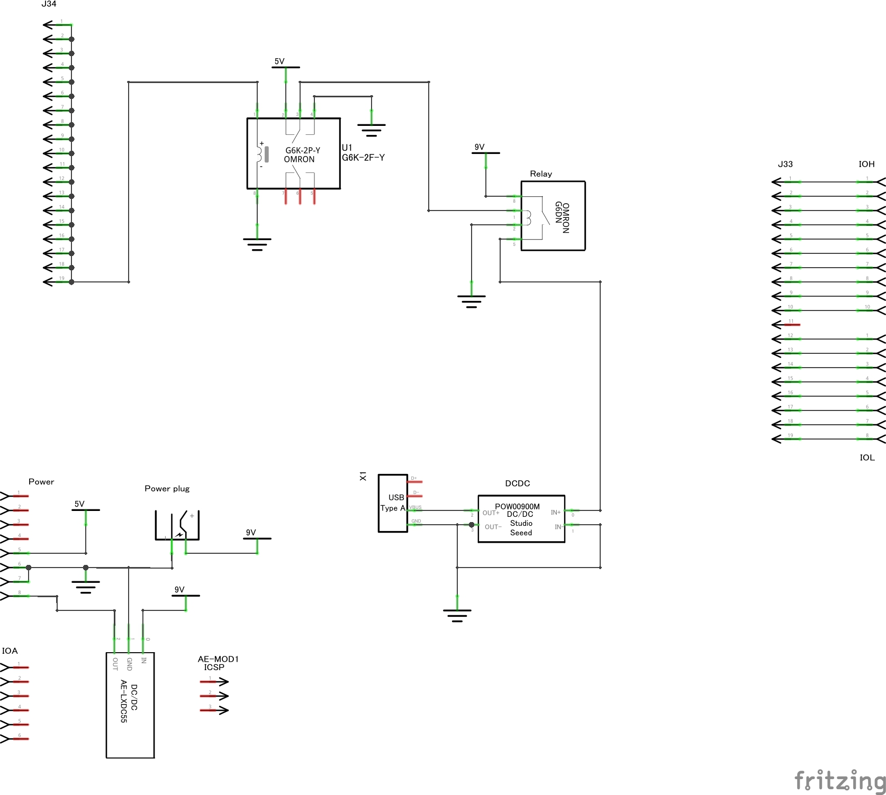
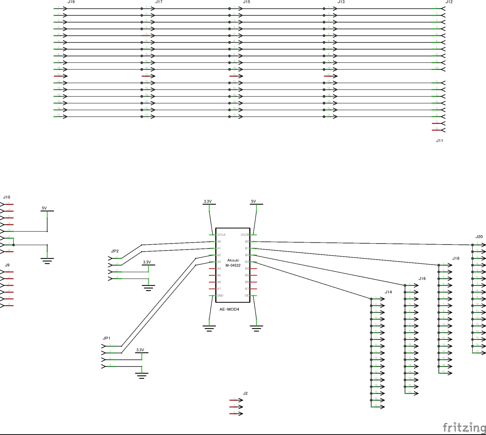
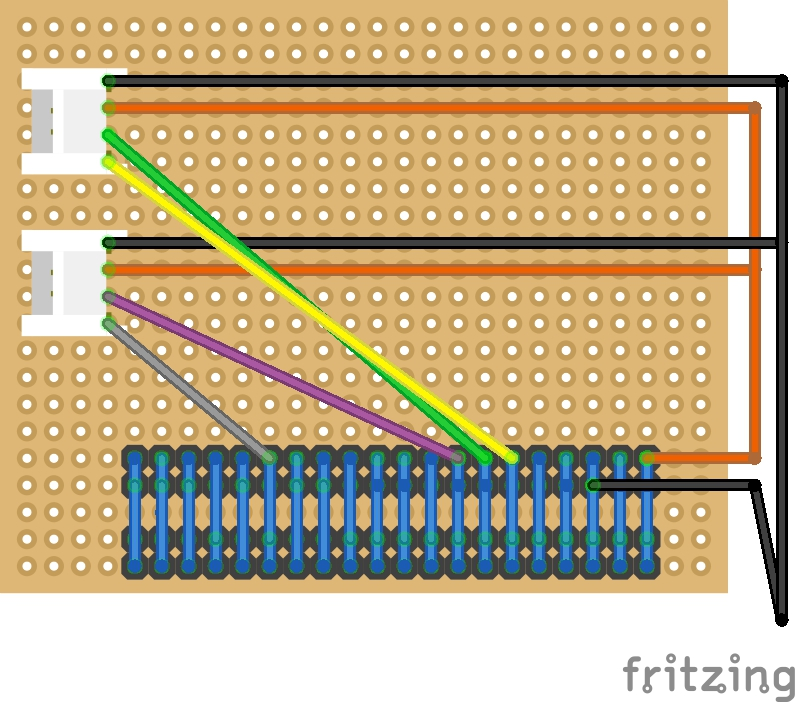
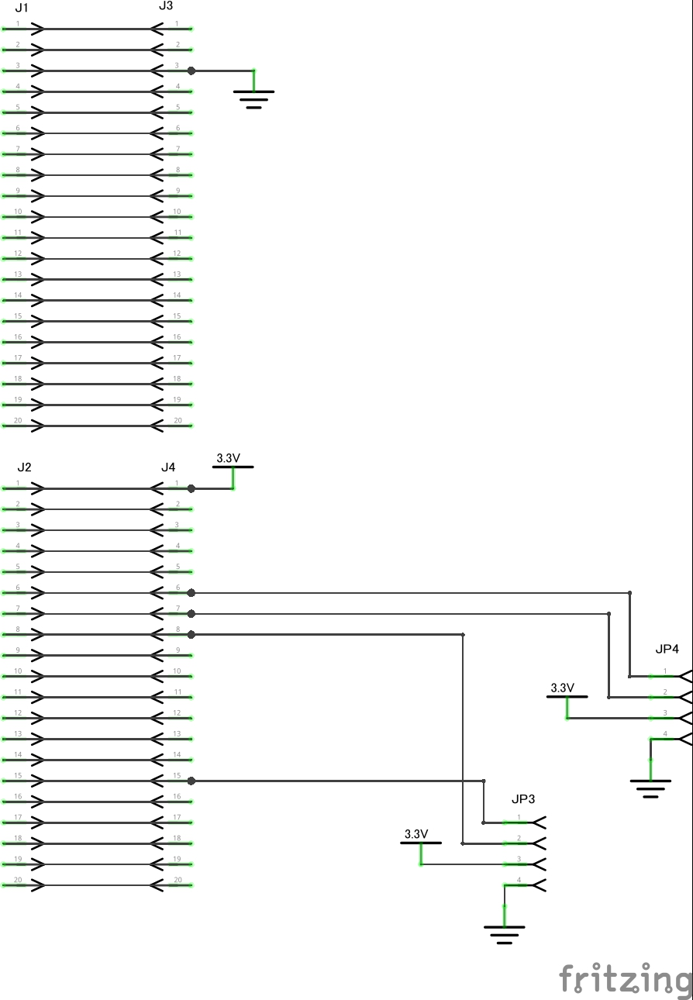
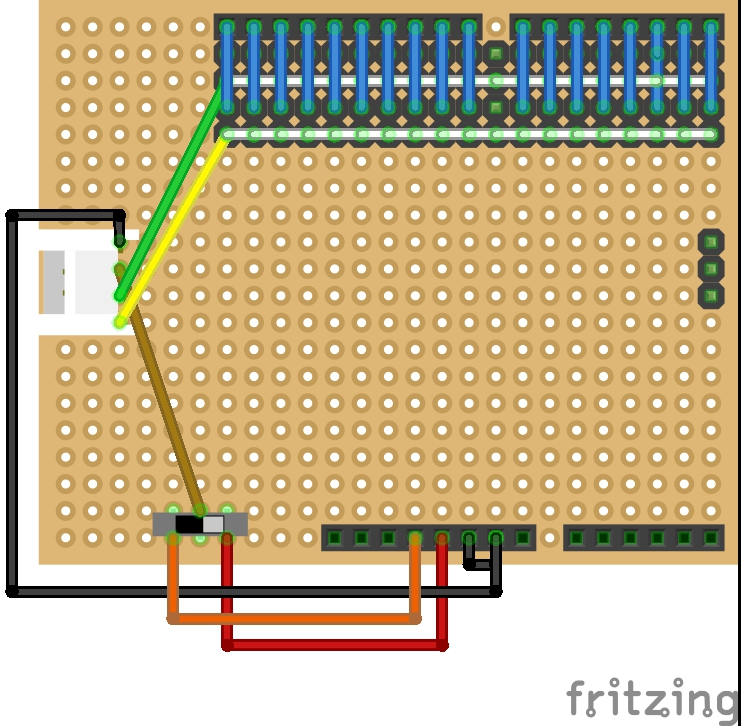
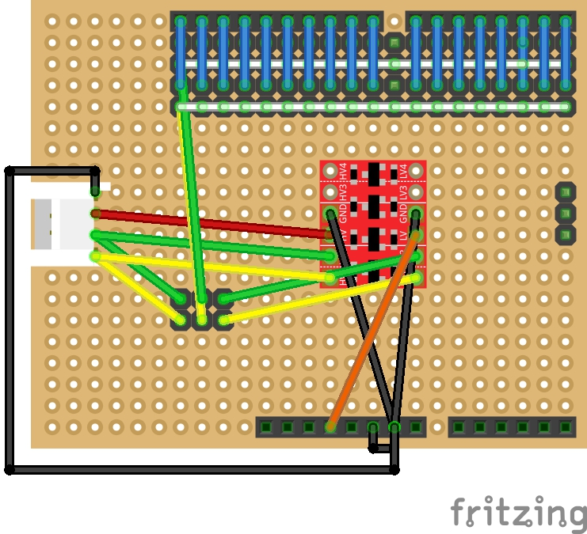
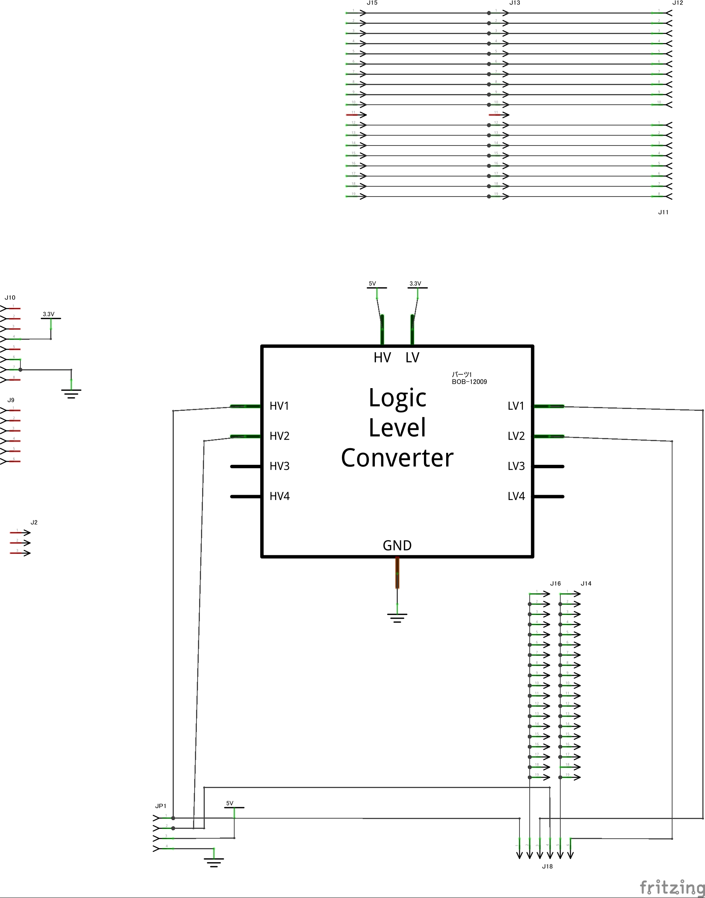

# PowerController
Raspberry Piの電源をArduinoで制御するシステム

## システム構成
### 全体

### 遠隔ログイン関連
Raspberry Piに異常が発生し，ハードリセットが必要な場合や，Raspberry PiのCPUが発熱した場合，設置場所が非常に高温になった場合など，
Raspberry Piへの電源供給を強制的に止めるなどの必要があり，そのため，外部からネットワーク経由で電源制御端末にコマンドを入力する
ための端末．

sshは暗号化処理にメモリとCPUパワーが必要なため，Arduino等のマイコンでは困難．もし，ssh接続が必須となる場合は，
ssh用にRaspberry Piを利用するか，Linuxで動作するモジュールが搭載された機種(Arduino YunやIntel Edison for Arduino)を
利用する必要がある．sshの代わりに，telnetを用いる場合，MCU内蔵のWiFiモジュールが利用可能となるため，
今回の試作では，ESP-WROOM2を利用した．

### Yunで全て行う場合
Arduino Yunを用いる場合は，電源制御端末と遠隔ログイン用端末が1つの筐体に収まるため，
構成が非常に単純になる．Intel Edison for Arduinoの場合も似た構成になるはずであるが，
試していない．

## ソフト
### Raspberry Pi用モジュール「powerMNG」
電源を供給される側のRaspberry Piで動作するdaemonで以下の機能を実装．
- 電源制御端末からのShutdown指示信号を監視し，shutdownを実行
- 自分自身のCPU温度を監視し，ファンを制御する信号をON/OFFした上，CPU温度が高すぎる場合に，電源制御端末に異常を通知した後，shutdownを実行

### PowerController
周辺の温度と湿度，電源ボタンを監視し，Raspberry Piに供給する電源をON/OFFするArduino用プログラム．
また，周辺の温度・湿度や電源制御状況をLCDに表示する機能もある．

以下は主な機能．
- 周辺の温度が高くなると，Raspberry PiにShutdown信号を出し，一定時間経過後に電源をOFFし，周辺温度が下がるまでその状態を維持
- Raspberry PiからCPU高温信号が来ると，一定時間経過後に電源をOFFし，一定時間経過後に周辺温度が規定値以下なら電源をON
- Raspberry Pi動作中に電源ボタンが押されると，Raspberry PiにShutdown信号を出し，一定時間経過後に電源をOFFし，その状態(強制電源OFF状態)を維持
- 強制電源OFF状態で電源ボタンが押されると，周辺温度を検査し，問題なければRaspberry Piへの電源供給を開始

#### 注意事項
Yun用の機能はテストしていない．

### WiFiTelnetToSerial
遠隔ログイン用にESP-WROOOM2を用いる場合のWROOM2用プログラムで，telnetで接続した場合に，認証を行い，
コマンド入力待ちとなる．コマンド入力待ち状態で接続コマンドが入力されると，電源制御端末のシリアルと中継を行う．
ログアウトする場合は，Linuxのminicomと同じくCtrl-Aでエスケープした後，ログアウトコマンドを入力する．

## システムを構成する上で利用するハードウェアモジュール(作成が必要なもの)
以下の回路(各種マイコン用シールド)は基本的に，電源制御端末は5V動作のもの，それ以外は3.3V駆動を
想定しているが，一部のハードモジュールは5V,3.3Vのどちらでも大丈夫なように設計している．
電源制御回路以外はどちらでも大丈夫なはずであるが，テストしていないため，注意していただきたい．

電源制御端末にArduino Zero等の3.3V動作の端末を用いる場合は，電源制御回路の信号用リレーを3.3V動作の
ものと交換することで対応できるはずである．

### 電源制御シールドUNO用
#### ユニバーサル基板図面

#### 回路図

### 電源制御シールドYun用
#### ユニバーサル基板図面

#### 回路図

### Pi-Arduino相互接続シールド Arduino用
#### ユニバーサル基板図面

#### 回路図

### Pi-Arduino相互接続シールド Pi用
#### ユニバーサル基板図面

#### 回路図

### WROOM2-Arduino相互接続シールド Arduino用
#### ユニバーサル基板図面

#### 回路図

### WROOM2-Arduino相互接続シールド WROOM2用
#### ユニバーサル基板図面

#### 回路図

## 作成が必要なシールドの設計図
fritzingの図面は「ハード関係」ディレクトリ配下に格納．

