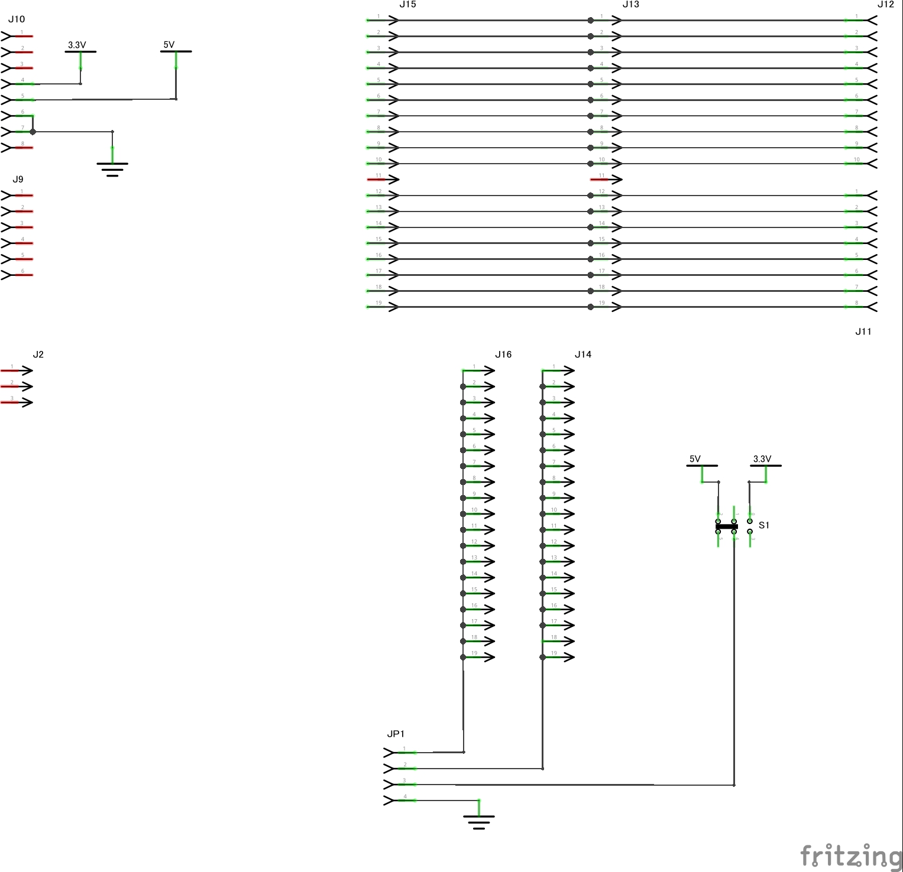

# PowerController
Raspberry Piの電源をArduinoで制御するシステム

## システム構成
### 全体

### 遠隔ログイン関連

### Yunで全て行う場合

## 利用するハードウェアモジュール

### 電源制御シールドUNO用
#### ユニバーサル基板図面

#### 回路図

### 電源制御シールドYun用
#### ユニバーサル基板図面

#### 回路図

### Pi-Arduino相互接続シールド Arduino用
#### ユニバーサル基板図面

#### 回路図

### Pi-Arduino相互接続シールド Pi用
#### ユニバーサル基板図面

#### 回路図

### WROOM2-Arduino相互接続シールド Arduino用
#### ユニバーサル基板図面

#### 回路図

### WROOM2-Arduino相互接続シールド WROOM2用
#### ユニバーサル基板図面

#### 回路図

